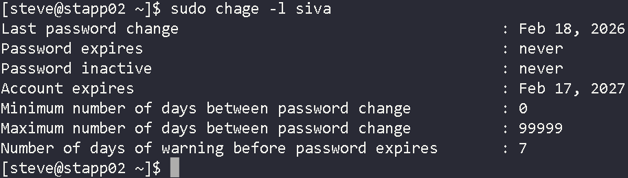
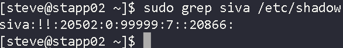

# Linux User Account Expiration Management

This project demonstrates user lifecycle management in a Linux enterprise environment. The objective was to create a temporary user account with a defined expiration date to enforce time-bound access control.

---

## Objective

Create a user named `siva` on **App Server 2** with an expiration date of **February 17, 2027**, ensuring adherence to naming standards (lowercase only).

---

## Skills Demonstrated

- Linux user account management
- Account lifecycle control
- Secure access provisioning
- Account expiration configuration
- Shadow file validation
- Enterprise Linux administration practices

---

## Tools Used

| Tool | Purpose |
|------|---------|
| `useradd` | Create user account with expiration |
| `chage` | Manage and verify account aging |
| `/etc/shadow` | Validate stored expiration settings |
| `SSH` | Remote server access |

---

## Implementation Steps

### Step 1: Connect to App Server 2

```bash
ssh user@app-server-2
```

### Step 2: Create user with expiration date

```bash
sudo useradd -e 2027-02-17 siva
```

### Step 3: Verify expiration settings

```bash
sudo chage -l siva
```

---

## Screenshots

### chage -l siva — Account expiration verification



### grep siva /etc/shadow — Shadow file validation



---

## Security Importance

Setting expiration dates for temporary accounts:

- Prevents forgotten active accounts from remaining accessible
- Reduces insider threat risk
- Supports audit and compliance requirements
- Enforces least-privilege duration policies

---

## Real-World Application

In production environments, temporary contractors, developers, or vendors should always have **time-bound access** to prevent long-term security exposure. Account expiration is a foundational practice in enterprise identity and access management (IAM).
